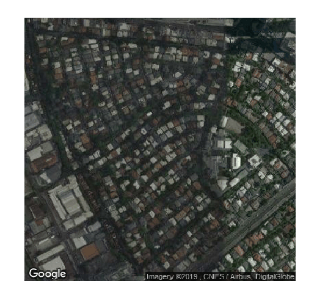

<p align="center">
    
</p>

<p align="center">
    <a href="https://storage.googleapis.com/tm-tiffany/releases/tiffany_latest_linux_amd64"></img></a>
    <a href="https://cloud.drone.io/thinkingmachines/tiffany"></img></a>
    <a href="https://godoc.org/github.com/thinkingmachines/tiffany"></img></a>
    <a href="https://goreportcard.com/report/github.com/thinkingmachines/tiffany"></img></a>
    <a href="https://github.com/thinkingmachines/tiffany/blob/master/LICENSE"></img></a>
</p>

A command-line tool for rendering to **TIFF any** image from Google Static Maps

`tiffany` downloads, georeferences, and labels any satellite image from the
Google Static Maps (API). You can use this to prepare labeled data for
downstream tasks such as in computer vision (object detection, semantic
segmentation, etc.)

## Features

- Download Google Static Maps Images straight from the command-line
- Automatically georeference downloaded GSM images (SRID: `EPSG:4326`)
- Create training labels for the images by clipping an ESRI Shapefile

With a single command,

```s
$ tiffany 14.546943935986324 121.01974525389744
```

you can generate the following outputs for an image centered at `(14.54694524, 121.0197543253)`.
Note that the `--with-labels` flag requires an input ESRI Shapefile preferably
from OpenStreetMap (OSM).

| Original image | Georeferenced  | With labels |
|----------------------------------------|-------------------------|-------------------------------|
| |   | |
| `--without-reference` | default | `--with-labels` | 


## Installation

### Getting the binaries

You can obtain the latest binaries from our
[Releases](https://github.com/thinkingmachines/tiffany/releases) tab. Make sure
to download the one compatible to your system. As of now, we only compile on
amd64 architectures:

|         | Linux (amd64)               | Darwin (amd64)               | Windows (amd64)               |
|---------|-----------------------------|------------------------------|-------------------------------|
| Latest  | [tiffany-latest-linux-amd64](https://storage.googleapis.com/tm-tiffany/releases/tiffany_latest_linux_amd64)  | tiffany-latest-darwin-amd64  | tiffany-latest-windows-amd64  |
| Nightly | [tiffany-nightly-linux-amd64](https://storage.googleapis.com/tm-tiffany/releases/tiffany_nightly_linux_amd64) | tiffany-nightly-darwin-amd64 | tiffany-nightly-windows-amd64 |


### Compiling from source

Alternatively, you can compile `tiffany` from source. You need
[go1.11](https://golang.org/doc/go1.11) and
[GDAL>=2.0.0](https://www.gdal.org/) to create successful builds.  First, clone
the repository and enter it:

```s
$ git clone git@github.com:thinkingmachines/tiffany.git
$ cd tiffany
```

Then get the dependencies and build the project:

```s
$ go get
$ go build .
```

Optionally, you can also install `tiffany` inside your system

```s
$ go install
```

## Usage

### Authentication

Tiffany requires a [Google Static Maps API
Key](https://developers.google.com/maps/documentation/maps-static/intro#get-a-key).
Generate one and store it inside an `.env` file in your project directory:

```s
# .env
API_KEY="<your API key here>"
```

### Getting images

To get images, simply call `tiffany`, and pass it your latitude and longitude:

```s
$ tiffany 14.546943935986324 121.01974525389744
```

<p align="center">
    

This will generate a directory, `tiffany.out` where a `*.png` and its
corresponding `*.tiff` file is located.

In case you don't want georeferenced images and prefer plain-old PNG images,
then simply pass the `--without-reference` flag:

```s
$ tiffany 14.546943935986324 121.01974525389744 --without-reference
```

Lastly, you can clip labels for your geo-referenced image from an ESRI
Shapefile. This is useful for downstream tasks such as in machine learning:

```s
$ tiffany 14.546943935986324 121.01974525389744 --with-labels=path/to/gis_osm_buildings_free_1.shp
```

## Getting multiple images

Rather than invoking a for-loop, it is also possible to get multiple images by
passing a CSV file containing the latitude and longitude of the
points-of-interest in the `batch` command. This method is more efficient and
relatively faster:

```
# coordinates.csv
latitude,longitude
14.546943935986324,121.01974525389744
14.438494843958949,121.84324983413455
14.879847197948529,121.81851791571952
```

And then,

```s
$ tiffany batch coordinates.csv
```

<p align="center">
    

## Contributing

Simply fork this repository and [make a Pull
Request](https://help.github.com/en/articles/creating-a-pull-request)! We're 
open to any kind of contribution, but we'd definitely appreciate:

- Implementation of new features 
- Writing documentation
- Testing

Also, we have a
[CONTRIBUTING.md](https://github.com/thinkingmachines/tiffany/blob/master/CONTRIBUTING.md)
and a [Code of
Conduct](https://github.com/thinkingmachines/tiffany/blob/master/CODE_OF_CONDUCT.md),
so please check that one out!

## Acknowledgements

- OSM data [copyright OpenStreetMap contributors](www.openstreetmap.org/copyright) and licensed under [Open Database License](opendatacommons.org/licenses/odbl)
- Use of Google Static Maps is governed by its [Terms of Use](https://cloud.google.com/maps-platform/terms/) and [Additional Terms of Service](https://maps.google.com/help/terms_maps/). You still need to acquire an API key in order to use this service.
- The tiffany logo was inspired by the Twitch logo, and was based from the font type created by [MaxiGamer](https://deltafonts.com/deviantart-font/). The color is based from Gopher Blue (`#00ADD8`) based from the [Golang Brand book](https://storage.googleapis.com/golang-assets/Go-brand-book-v1.9.5.pdf)

## License

MIT License (c) 2019,  Thinking Machines Data Science

